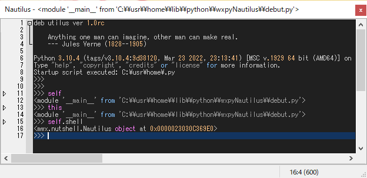

# Shell standalone

Move to wxpyNautilus directory and run "debut.py" to startup REPL::

    $ py -3 debut.py

!!! Note

    * mwxlib creates ~/.mwxlib/ in your home directory.
      This includes history, logs, dump files used to report when an error occurs.
    
    * At the first startup, it takes some time to collect module information and create a dictionary.
      The collected module name is used for completion at the time of input in the shell.
      If you start the shell while pressing [C-S-], the dictionary will be recreated.

## Basic access

Objects in the process can be accessed through ``self`` and ``this``, e.g.,

    >>> self
    >>> this
    >>> self.shell

!!! Tip

    - The ``self`` is the target object of the shell, that is, ``__main__`` module in the startup root shell.
    - The ``this`` is the module that includes ``self``.
    - The ``self.shell`` is a special variable that points to the current shell instance.

There are many shortcut keys defined as default.
Hereafter, we use the following abbreviations:

    * [C-x] Control (Command) + x.
    * [M-x] Alt (Meta) + x.
    * [S-x] Shift + x.
    * [C-x y] press [C-x] followed by [y] (aka. two-stroke key)

