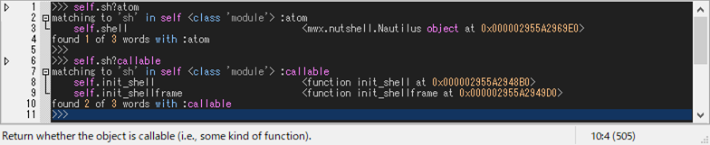

# How to inspect

## Autocomp

Typing a dot [.] automatically invokes word-comp-mode and the autocompletion list popups at the caret.
It can also be invoked manually by pressing [M-.].
Word-comp-mode displays a list of keys in the object that *matches* the entered word.

    >>> self.sh|
               ^ press [M-.]

Another useful autocomp function is apropos-comp-mode, which can be invoked by pressing [M-/].
Apropos-comp-mode displays a list of keys in the object *searched* for the entered word.

    >>> self.sh|
               ^ press [M-/]

## Apropos

Similar to the apropos-comp-mode, there is apropos command that outputs keys and values in the object *searched* for the entered word.

Apropos command is especially useful to inspect what attributes an object has or has not.
Suppose that you want to know what kind of blurring functions are contained in ``cv2`` module.
You can inspect it by typing:

    >>> cv2.blur?

You can see two things.
1. There are three kind of blurring functions;
2. There are no functions other than these three blurring functions.

!!! Tip

    The argspec information is displayed on the statusbar as you move the caret over the output string.

Apropos command uses ``dir()`` to list as many attributes as possible.

    >>> self.sh?

It can be combined with predicates that placed after ``?`` as follows:

    >>> self.sh? atom
    >>> self.sh? callable

!!! Tip

    The syntax of apropos command is as follows:
    
        >>> x.y? [not] p
    
    ``p`` can be any predicates such as ``atom``, ``callable``, ``type (e.g., int, str, ...)``, 
    ``inspect`` functions, and a combination of those using ``not, and, or`` operators.

Let's take a look at the predicates available in the ``inspect`` module, which starts with 'is',

    >>> inspect.^is? callable

which gives,

## Tooltip

While typing, you may want to check if the code and the syntax is correct.
Pressing [C-j] shows a tooltip of evaluated results for the selected word or line.

    >>> cv2.GaussianBlur|
                        ^ press [C-j]

Pressing [C-h] shows a tooltip of argspec for the selected word. 

    >>> cv2.GaussianBlur|
                        ^ press [C-h]

If the tooltip text is too long to display, it will be snipped.
If you want to read the document, **click the tooltip**.
Then, the full text will be displayed in the **Help** window.
The help window can also be displayed by typing ``@help`` after the object for which you want documentation.

    >>> cv2.GaussianBlur @help

