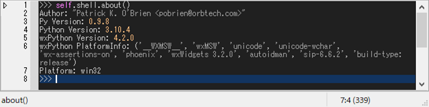

# How to debug

## command-hook

In command-hook mode, you can specify the function to debug in the shell prompt.
Here, we take the shell function ``about()`` as an example.

    >>> self.shell.about()



To enter debug mode, type ``@debug`` after the normal function call:

    >>> self.shell.about() @debug

<video width="786" controls src="./_static/0-2a_debug-command-hook.mp4">
</video>

Key bindings for debugger::

    C-g     : quit
    C-q     : quit
    C-n     : next   (step-over)
    C-s     : step   (step-in)
    C-r     : return (step-out)
    C-b     : set a breakpoint at the current line.
    C-@     : jump to the first-lineno of the code.

After exiting debug mode, you can check the stack frames::

    f10     : grep frame forward
    S-f10   : grep frame backward

If you want to view the code, right click **Log** tab and select the file.
If you want to view the debugging log, select ``*log*`` buffer.


## trace-hook

In trace-hook mode, you can specify the function to debug in **Log** window.

1.  Select the file in **Log** window.
    If the file is not found, it can be loaded by placing the cursor on the target and pressing [f2].
    ```
    >>> function|
                ^ Press [f2] to load the file in **Log** window where the function is defined.
    ```

2.  Press [C-S-space] in **Log** window to set a trace pointer (=>) where you want to break at.

    !!! note
        The system is about 2-3 times slower while tracing.
        To quit tracing, press [C-g].

3.  If the system reached the breakpoint, the **root shell** enters debug mode.

    <video width="786" controls src="./_static/0-2a_debug-trace-hook.mp4">
    </video>

Note that the debugger doesn't stop until it reached the bottom frame, in this case, shell input frame.
Since the shell input is executed in the mainloop i.e., the main-thread, it will enter ``EVT_IDLE`` handler endlessly. In this case, press [C-g] to exit the debug mode.


## event-hook

In event-hook mode, you can specify the event handler to debug in **Monitor** window.

1.  Move to **Inspector** window.

2.  Right-click the target widget and select [Watch the event] menu.
    Then, it starts monitoring wx events.

3.  Tick the checkboxes of the events you want to hook.
    Blue string indicates that the event handler is user-defined and hookable.

4.  When the event is fired and the handler is called, the **current shell** enters debug mode.

    <video width="786" controls src="./_static/0-2a_debug-event-hook.mp4">
    </video>

!!! Note

    Since ver 0.75, monitor and inspector windows will be included in the watcher window.

!!! Tip

    Press [F11] to show ghost window containing buffer/editor, monitor, and inspector windows.
    Press [S-f11] to show the watcher window containing globals and locals lists.

Key bindings for the shellframe::

    f11     : toggle_window<'Toggle ghost'>
    S-f11   : toggle_window<'Toggle watcher'>
