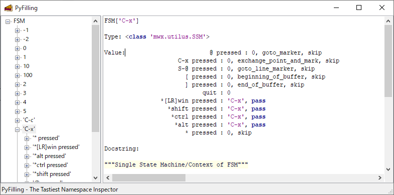

# How to dive

## Scratch

**Scratch** window is a scratch notebook of code snippets similar to emacs ``*scratch*`` buffer.
You can open, close, and save the script file in the buffer.

You can also debug the code in the following step:

1.  In **Scratch** window, select the buffer you want to debug.

2.  Pressing [M-j] compiles the code and evaluetes it in the currently selected shell namespace.
    The code "<scratch>" now can be referenced from the debugger of the shell.

3.  Then, you can debug the code using :ref:`command-hook` and :ref:`trace-hook` as well as the **Log** window.

    <video width="786" controls src="./_static/0-2b_scratch-command-hook.mp4">
    </video>

Key bindings of Scratch::

    C-x C-o     : open
    C-x C-s     : save
    C-x S-s     : saveas
    C-x C-l     : load
    C-x C-k     : kill-buffer
    C-x k       : kill-all-buffers
    C-x C-n     : new-buffer
    M-j         : exec-buffer
    C-j         : eval-line


## Magic syntax

Nautilus shell accepts some magic syntaxes e.g.,

```python
>>> x`y
# interpreted as (quoteback):
# ==> y=x

>>> x@y
# interpreted as (pullback):
# ==> y(x)
```

For example,
```python
>>> 5 @range @list @p
[0, 1, 2, 3, 4]
```

In Ruby, one of the popular programming languages, you can chain methods like this:

```ruby
irb> p 5.times.to_a
[0, 1, 2, 3, 4]
```

Note that in contrast of Ruby, it can also chain ``p (print)`` function.
Actually, it can chain not only methods but also *any* functions as follows:

```python
>>> buf @io.BytesIO @Image.open @np.asarray @plt.imshow; plt.show()
# interpreted as:
==> plt.imshow(np.asarray(Image.open(io.BytesIO(buf)))); plt.show()
```

<video width="786" controls src="./_static/0-3a_magic-syntax.mp4">
</video>

.. seealso::

    The name "pullback" comes from mathematical terminology.
    Pullback is like a mathematically defined synonym of substitution.
    https://en.wikipedia.org/wiki/Pullback


## Built-in utilities

Nautilus has some useful functions in ``builtin`` module::

    @p          Synonym of print.
    @pp         Synonym of pprint.
    @info       Short info.
    @help       Full description.
    @load       Load file in Log buffer.
    @where      Displays filename:lineno or the module name.
    @mro        Displays mro list and filename:lineno or the module name.
    @dive       Clone the shell with new target.
    @debug      Open pdb or event-monitor.
    @timeit     Measure the duration cpu time (per one execution).
    @profile    Profile a single function call.
    @filling    Inspection using ``wx.lib.filling.Filling``.
    @watch      Inspection using ``wx.lib.inspection.InspectionTool``.


### p(print) / pp(pprint) / filling

    >>> self.shell.handler @p
    # Display shell key bindings.


The special object **handler** is like DNA, defining how the object interact in a process.
In fact, it is a simple dictionary of Finite State Machine (FSM) that maps states to transitions and actions.

In this case, ['C-x'] state has the key-event ['@ pressed'], thus two-stroke typing [C-x @] invokes ``goto_marker`` which moves the caret to the marker (o) position.

You can also use fancy view of the key bindings using ``PyFilling`` window.

    >>> self.shell.handler @filling
    # Show shell key bindings in ``PyFilling`` window.




### where / load / mro

The command ``where`` is used to find the source code.

    >>> self.shell @where
    # Displays the source code filename:lineno.


Default **Log** window can be used to open the file.

    >>> self.shell @load
    # Loads the source code in **Log** window.


If you like to open the file with your editor, define a function ``edit('filename:lineno')`` somewhere such as 'PYTHONSTARTUP' script file. Then, you can open the file like this:

    >>> self.shell @where @edit


The command ``mro`` displays mro list of the object with filename:lineno.
You can grep those files if exist, using [f10]: grep-forward, [S-f10]: grep-backward.

    >>> self.shell.handler @mro
    # Displays mro list and filename:lineno or the module name.


### dive

The command ``dive`` is equiv. to ``rootshell.clone`` which creates a new shell with the specified target in the new page.

    >>> self.shell @dive
    # Clone the shell with the specified target.
    # In this case, that target is the ``rootshell<Nautilus>`` itself.


