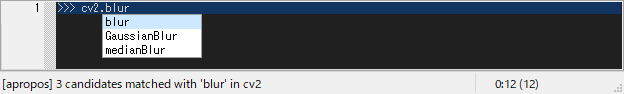
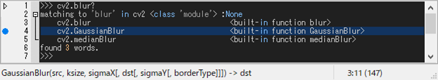
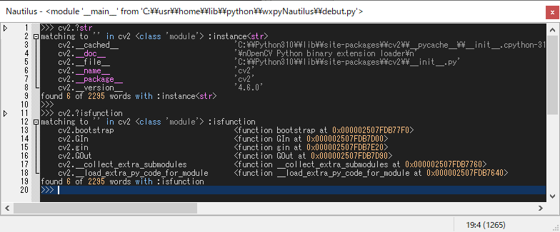
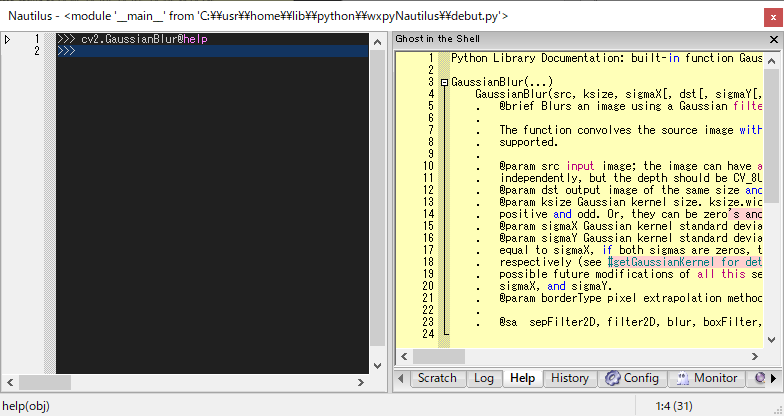

# Introspection

## Autocomp

Typing a dot [.] automatically invokes word-comp-mode, and [escape] exits the comp-mode.

Word-comp [M-.] displays a list of keys in the object that *matches* the entered word.


Apropos-comp [M-/] displays a list of keys in the object *searched* for the entered word.



cf. Apropos command outputs keys and values in the object *searched* for the entered word.



Text-history [M-,] displays a list of text that *matches* text previously displayed to the shell.


Module-comp [M-m] displays a list of modules that *matches* the entered word, which is invoked when typing ``import`` or ``from-import``.


There are five comp-modes as follows.
All completions [1--5] are incremental when pressed any alnums, and decremental when backspace.

Autocomp key bindings::

    C-up        : [0] retrieve previous history
    C-down      : [0] retrieve next history
    TAB         : [1] history-comp-mode
    M-p         : [1] retrieve previous history in comp-mode
    M-n         : [1] retrieve next history in comp-mode
    M-.         : [2] word-comp-mode
    M-/         : [3] apropos-comp-mode
    M-,         : [4] text-comp-mode
    M-m         : [5] module-comp-mode


## Apropos

Apropos command outputs keys and values in the object ``x`` using `dir(x)`
*searched* for the entered hint word ``y`` with &optional ``p:predicates``.

```python
>>> x.y? [not] p
# equiv.
>>> apropos(x, y [,ignorecase=?:True,??:False] [,pred=p])
```

- x: root object,
- y: hint that can contain regular expressions,
    * ``y`` can contain regex, but not a dot.
    * ``y`` can contain abbreviations: \\a:=[a-z], \\A:=[A-Z].
- p: predicates that can be either the following predicate or a combination of those using not, and, or.
    * ``p`` can be ``atom``, ``callable``, ``type (e.g., int, str, ...)``, and ``inspect`` functions such as 
      ``isclass, ismodule, ismethod, isbuiltin, isfunction, isgenerator, isframe, iscode, istraceback``, etc.




## Tooltip

Tooltips are used to display object values and function argspecs.

-   [C-j] shows a tooltip of evaluated results for the selected word or line.
-   [C-h] shows a tooltip of argspec for the selected word. 


If the tooltip text is too long to display, it will be snipped.
When you click the tooltip, the entire text is displayed in the Help window.



One of following typing shows full description about ``x``.

    >>> x @help
    # or
    >>> x @??
    # or
    >>> ?? x

One of following typing shows short information about ``x``.

    >>> x @info
    # or
    >>> x @?
    # or
    >>> ? x


