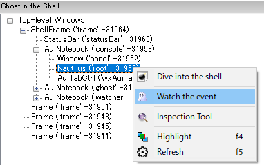

# Debugger

Nautilus debugger is based on ``pdb``.
In addition, some shortcut keys can be used to step-in, out, and over the stack frames.
There are three ways to enter debug mode.

1.  command-hook

    Specify the function to debug in the shell prompt.

2.  trace-hook

    Specify the function to debug in the traceable window.
    "Traceable" here means that the pointer can be set and the system can hook the point.
    **Log**, **Scratch**, and **Config** windows are traceable by default.

3.  event-hook

    Specify the event handler to debug in the monitor window.

Key bindings::

    C-g     : quit
    C-q     : quit
    C-n     : next   (step-over)
    C-s     : step   (step-in)
    C-r     : return (step-out)
    C-b     : set a breakpoint at the current line.
    C-@     : jump to the first-lineno of the code.

## command-hook

Typing function you want to debug followed by ``@debug`` enters debug mode in the shell as follows:

    >>> f(...) @debug

Then, **Log** and **Wacher** windows will popup to display the current frame and the local variables.
The mark (o) indicates the entry point of the code. 
The pointer (=>) indicates the position of the current frame.

## trace-hook

Press [C-S-space] in **Log** window to set a trace pointer (=>) where you want to break at.
When the frame reached the point, the shell goes to the debug mode.

!!! note

    The system is about 2-3 times slower while tracing.
    To quit tracing, press [C-g].

!!! tip

    To display the function, type in the shell as follows:
    
        >>> f @load
    
    Or, press [f2] key when the caret is at the function.
    
        >>> f|
             ^ press [f2] key

## event-hook

This mode is for wx.Event handlers that need to be called with proper event arguments.

Move to Inspector window.
Right-click the target widget and select [Watch the event] menu.

You can monitor the events bound to the target widgets in Monitor window.
Tick the checkboxes of the events you want to hook, where blue string indicates that the event handler is user-defined and hookable.

When the event is fired and the handler is called, the shell goes to the debug mode.

