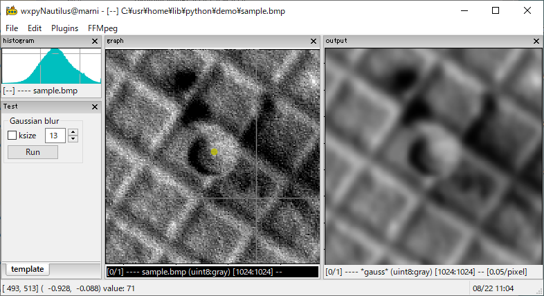

# wxpyNautilus

Welcome aboard Nautilus! [^1]
This is a python package based on matplotlib/wxPython and wx.py.shell extension library.

The goal of our journey is the rapid development of image processing (using cv2/pillow)
and the graphical user interfaces (using matplotlib/wxpython). 
To accomplish this, the framework consists of two main classes:

1. A plugin-style GUI mainframe

    A `Plugin` means a python script file to process images, 
    which user can load, edit, reload, unload, and debug without terminating the program.

    

2. An interactive shellframe

    You can communicate with the main process using an interactive shell, 
    inspect, test, and debug the code at runtime.

    


## Getting Started

### Prerequisites

This software works with **Python 3.8 and later versions**.

1. Download the zip file from [wxpyNautilus GitHub repository](https://github.com/komoto48g/wxpyNautilus)
    and extract it to a suitable directory.

2. Install [mwxlib](https://github.com/komoto48g/mwxlib) from [PyPI](https://pypi.org/project/mwxlib/).

    ```
    $ pip install mwxlib
    ```


The mwxlib depends on the following packages:

- wxPython (Phoenix)
- matplotlib
- numpy
- pillow
- opencv-python


[^1]: "Nautilus" is named after my favorite novel
      [海底二万里 : Twenty Thousand Leagues Under the Seas](https://en.wikipedia.org/wiki/Twenty_Thousand_Leagues_Under_the_Seas) written by Jules Verne.

[^2]: For Python 3.6 -- 3.9, wxpython >= 4.1.1 is required.
      For Python 3.10, wxpython >= 4.2.0 is required. 
      You can also download the latest snapshot from https://wxpython.org/Phoenix/snapshot-builds/.
